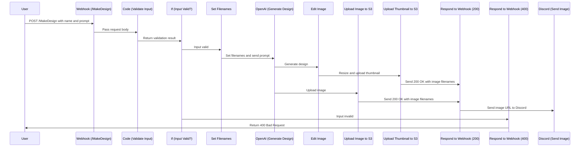
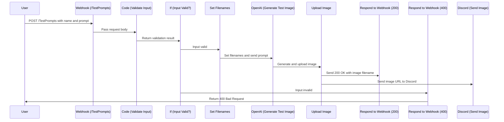

# Image Gen Service

### Connection info : 

**Swagger** : [swagger.yaml](https://github.com/GMIC-Helios-Team/ReadMe/blob/main/swagger.yaml)

## Endpoints 
### /webhook/MakeDesign

### /webhook/TestPrompts
Use this endpoint to help refine images. Generated Images to upload to [Discord Channel : image-gen-dev]

