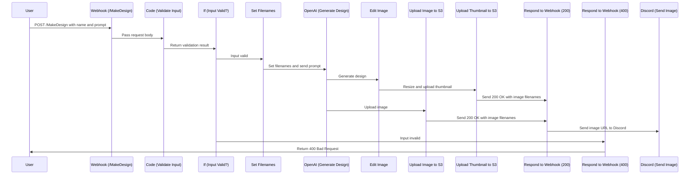
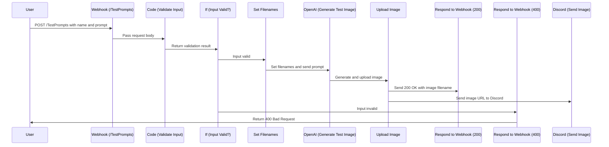

# Helios Gallery Project - [helios.gallery](https://helios.gallery)

## Project Summary
The Helios Gallery Project is an interactive, AI-driven web application designed to generate and share custom images based on user input. Built with a dynamic user experience, the application offers image generation with custom themes, a playful Rock-Paper-Scissors game, and a gallery to view, like, and rank generated images. It leverages multiple integrations and technologies, including N8N workflows for automation, MongoDB for data storage, SendGrid for emailing, and RabbitMQ for queuing tasks.

 

## Endpoints 
### /webhook/MakeDesign

### /webhook/TestPrompts
Use this endpoint to help refine images. Generated Images to upload to [Discord Channel : image-gen-dev]

